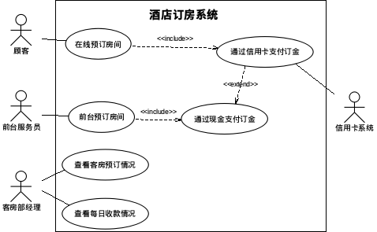
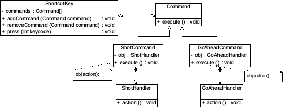
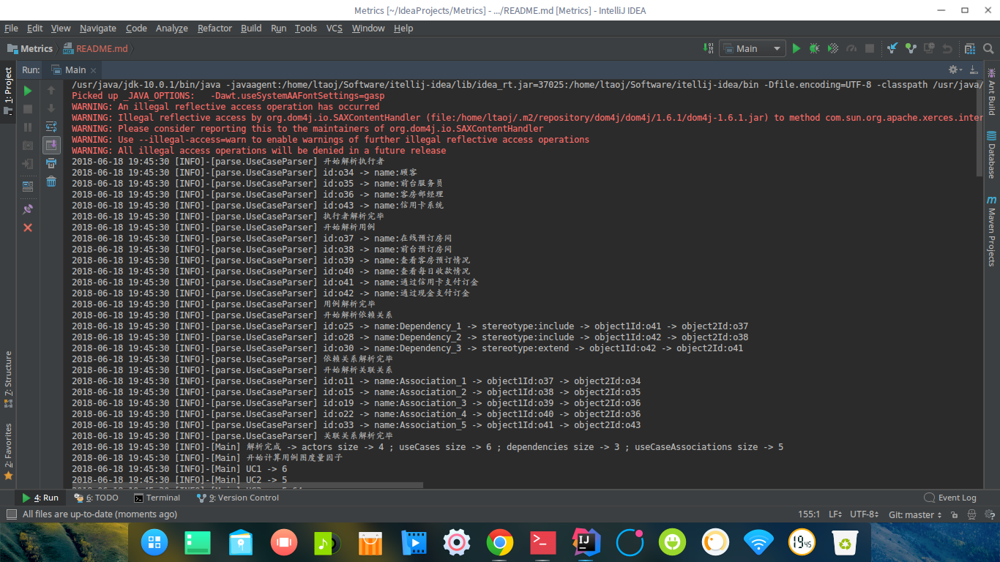
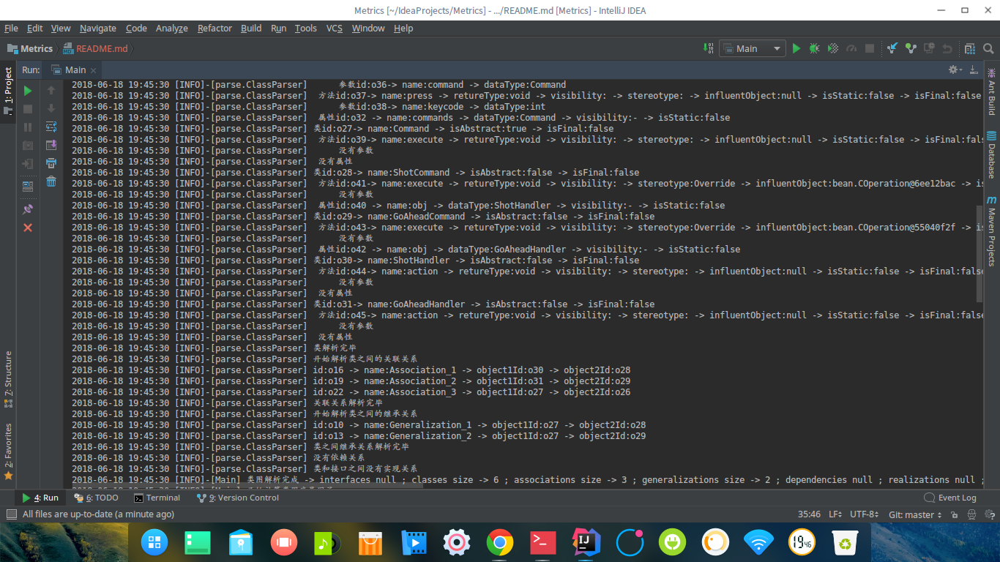

## **Metrics**

|**`Linux`**|**`License`**|
|-----------|-------------|
|[ ](https://www.travis-ci.org/ltaoj/ClassMine)|[ ](https://github.com/ltaoj/ClassMine/blob/master/LICENSE)|

**Metrics** 用于通过解析PowerDesigner工具产生的xml文件，对用例图、类图进行度量.

## Develop Tool
- Intellij IDEA

## ScreenShot
- 用例图类图分析结果
    - 
    - 
    - 
    - 
## Requirements
- Java -- the following:
	- Java == 10
- Jar Library -- the following:
    - junit == 4.11
    - log4j == 1.2.17
    - dom4j == 1.6.1
- Maven -- the following:
    - version 3.3.9

## Installation
*Type the commands below.*
```
git clone https://github.com/ltaoj/Metrics.git
```
*Then you should use your IDE to open this program*
    
## License

The source code in this repository is governed by the **MIT license agreement**, which is contained in **LICENSE.md**, adjacent to this file.